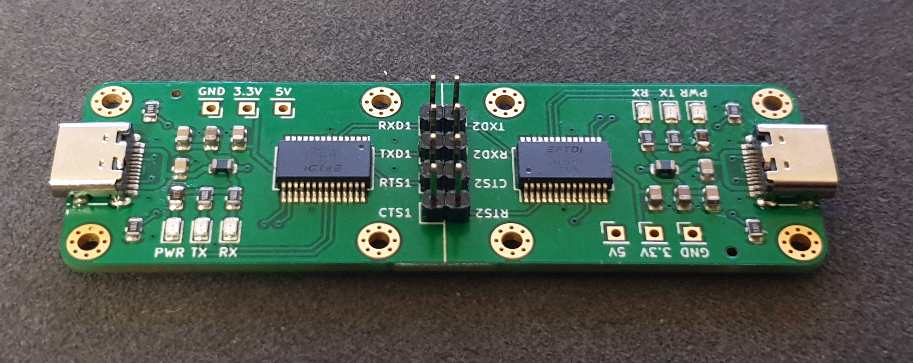

# USB-Serial-USB Bridge

Bridge converting USB-C to serial (TTL) back to USB-C.
Useful for debugging Linux on devices without easily accessible serial ports.


## Notes

- Uses two [FT232RL](https://ftdichip.com/products/ft232rl/) chips for USB-serial conversion.
- Jumpers can be used to connect RX/TX and RTS/CTS lines at will.


## Usage

_Requirements:_

- A kernel supporting the FT232 USB to serial converter.
  Ideally you will have USB and FT232 built into the kernel (`=y`) or the initramfs to enable early support at boot.
- The USB-serial-USB bridge (or alternatively two similar USB-serial converters).

_Usage:_

- Connect the jumper pins for the RX/TX (and optionally RTS/CTS) line pairs (i.e. TX1 to RX2, RX1 to TX2, and so on).
- Connect the bridge to your host PC and your client to be debugged.
- Open a terminal on your host PC, e.g. via `minicom`:
  ```sh
  minicom --device /dev/ttyUSBn --baudrate 115200
  ```
  Make sure that you have selected the correct `/dev/ttyUSBn` device, where `n` stands for the device number of the serial bridge on the host.
- Boot the kernel to be debugged on the client with the following command line options:
  ```
  console=ttyUSBn,115200 console=tty0
  ```
  Note that `console=tty0` is optional.
  This causes the main console to be allocated on the client itself, otherwise you will get no output on that device.
  If you wish for the main console to be on the USB-serial device, you can switch those statements.
  Again make sure to replace `n` with the correct device number (usually `0` assuming you have no other USB-serial device connected).

You can replace the baud rate (`115200`) with your desired one, however, make sure that it is set identically on both devices.
For further options see the respective kernel parameter documentation and the manpages for `minicom`.


## Preview

<p align="center">
  
</p>
